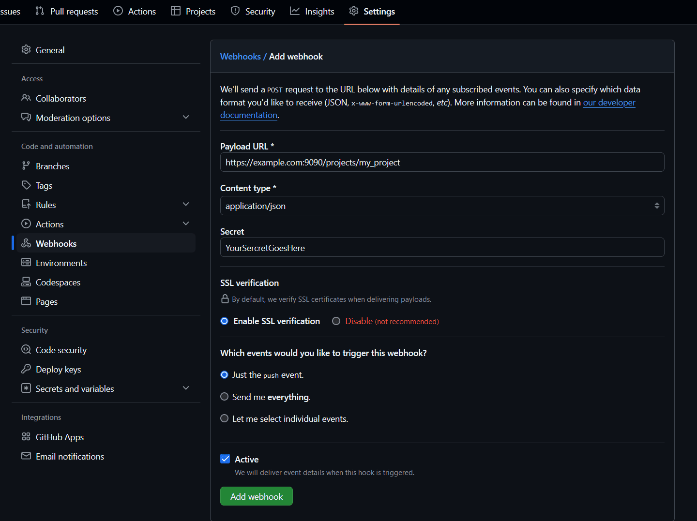

# Guide on how to setup git webhooks.

This document attempts to provide a step-by-step guide on how to setup github
webhooks, so it will be handled by your project.

## Prerequsites 
- You have some kind of a server and a domain.
- You installed the app (please refer to the 
[installation](../README.md#installation) section of the README)
- Optional but recommended: obtain SSL certificates for your domain and added it
to the app config (please refer to [this guide](./ssl-or-nginx-setup.md) if you
need help)
- You created the init scripts so the app launches at startup.
If your system uses systemd (ubuntu, debian, fedora, atch, etc.) you can refer 
to [this guide](./systemd-init-script.md)
- You created a basic config file as described in the [README](../README.md) and
config [example](../config.example.yml) with or without any projects in.

In this guide we will use `example.com` as placeholder for your domain.

## Verifying that your setup is operational

You can verify that your system is operational by running it -- it will just
listen without any webhook posts. If you created a systemd init script, than
you can run:

```sh
systemctl start git-webhook-receiver.service
```

and then try to open the inspection api logs in your browser:
```
https://example.com:9090/logs
```
Notice the port: 9090. It's the default port, the app launches on, unless you
override it in the config or setup a reverse proxy.

## Creating a project in the config file

In the project section of your config, create a new project (choosing a suitable
name for it) as follows:

```yaml
projects:
  my_project:
    repo: "your-github-userhandle/reponame"
```

`repo` value must match to what you see in the repo url in your browser after
`https://github.com`.

For additional security -- to make sure no bad actor will try to trigger your
pipeline trying to impersonate github, we will you use secrets for signing 
github payload.

First we must generate a random string sequence. This can be done in many 
different ways, we will use:

```sh
openssl rand -base64 42
```

copy this random value to your config and add the required script into action:

```yaml
projects:
  my_project:
    repo: "your-github-userhandle/reponame"
    secret: "YourSecretGoesHere"
    actions:
      - branch: main # or master depeding on your repo setup
        # where do you plan to run the action
        # most likely where do yo cloned the repo on the server
        cwd: "/var/www/default" 
        script: |
          git fetch && git reset --hard origin/main
          npm ci
          npm run build
```

## Setting up webhooks in your github repo

In github, go to your repo `Settings` page (it's the rightmost tab) and select
`webhooks` section.

Click "Add Webhook" button and enter your MFA code if required.

In the opened fill out the form:

- In the `Payload URL` field enter `https://example.com:9090/project/my_project`
  Don't forget to use the actual domain instead of example.com and your project
  name from the config.
- In the `Content type` field select `application/json`
- In `Secret` field enter your previously generated secret, that you used in the
config.



If you have SSL enabled in your config, then leave `SSL Verification` radio 
button as enable, disable it otherwise.

Most likely you want just the push event, so in the section 
`Which events would you like to trigger this webhook` you can leave `Just the 
push event`.

Press `Add webhook` button. Github well shortly send the ping event, which you 
can use to verify that everything works as expected.

After a push event to your target branch, there should be a recent delivery
in github webhooks page, with a status of 201 and response body (in the response
tab) like:
```json
[{"actionIdx":0,"project":"my_project","pipeId":"01JCPSSCDAKKCDBN9VFB589ZE3B"}]
```

If you have 200 status instead, it means that action didn't match on branch or 
event, most likely you messed up `master` and `main` and have to change it in 
config and restart the app.

You can verify through the inspection
API of the app, that pipeline ended in success. To do that, open in your browser
```
https://example.com:9090/pipelines
```


Congrats, you finished the setup.